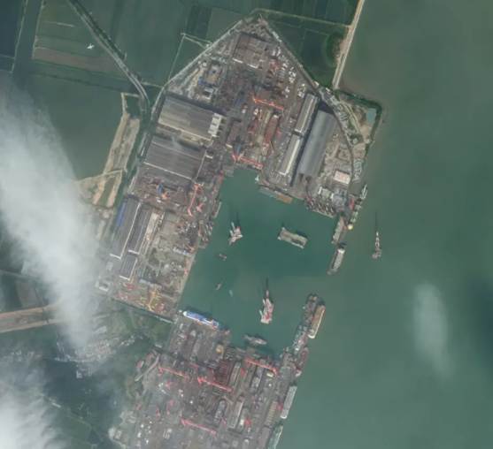
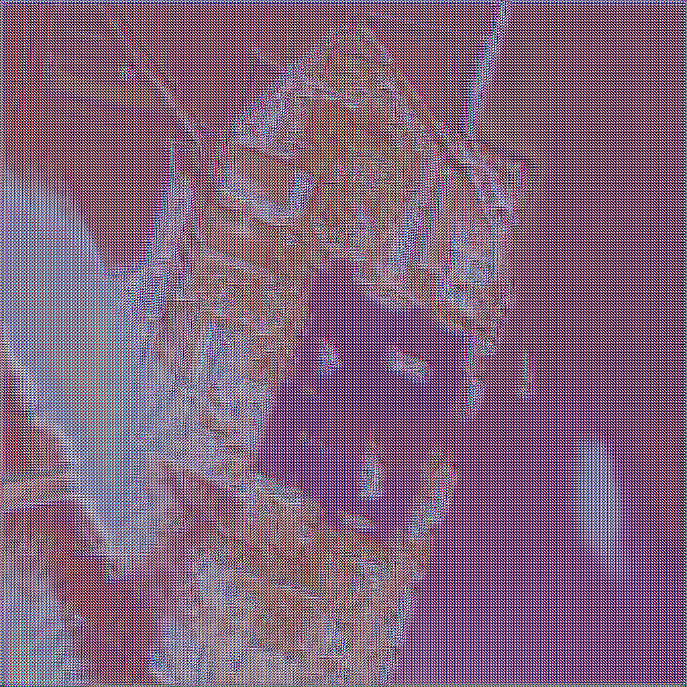

# Cloud Cleaning and Enhancement model
This model detects clouds in a satellite image using a made-from-scratch ResNet18 model. Cloud segmenter identifies the cloud area in image and then GatedPartialConv cleans the clouds from images. The image is enhanced using RRDB (ESRGAN).

## Table of Contents
- [Tech Stack](#tech-stack-used)  
- [Model Structure](#model-structure)  
- [How to use?](#how-to-use)

## Tech Stack used
| Stack | Tech |
|----------|----------|
| Language |  |
| Data Handling    |   |
| ML    |    |
| Vision    |   |
| File handling |   |
| Datasets |  |
| Training |   |
| Pretrained weights |    |

## Model structure
```
satellite-image-cleaning/
│
├── checkpoints/                    # best weights after training 
│   ├── cloud_classifier_best.pth   # generated after running train_classifier.py
│   ├── cloud_segmenter.pth         # generated after running train_segmenter.py 
│   ├── gated_conv_inpainting.pth   # generated after running train_inpainter.py
│   └── RRDB_ESRGAN_x4.pth          # pretrained RRDB weights (download from github)
│   
├── data/                           # contains cloudy and clear images data     
│   ├── train/ 
|       ├── clear/
|       └── cloudy/
│   ├── val/
|       ├── clear/
|       └── cloudy/
|     
├── inpainting_data/                # contains images and their masks to learn inpainting    
│   ├── images/
|   └── masks/
|
├── models/
|   ├── cloud_classifier.py         # classifies if image has clouds
|   ├── cloud_segmenter.py          # identifies the clouds in image
|   ├── esrgan.py                   # model for enhancement
|   ├── partialconv_network.py      # gated partial conv network
|   └── partialconv.py              # gated partial conv model
|
├── partial_conv                    # partial conv repo from github
|                                      
├── satellite_env                   # virtual env
|           
├── segmentation_data/              # contains images and their masks to learn cloud segmentation    
│   ├── images/
|   └── masks/
|
├── testing-env/                    # contains input and output images
|   ├── inputs/
|   └── outputs/
|
├── utils/                          # preprocessing
|   ├── prepare_dataset.py
|   └── preprocess.py
|
├── .gitignore    
├── LICENSE
├── README.md
|
├── pipeline.py                     # model pipeline
├── pipeline512.py                  # robust model that outputs high res image (uses more than 15GB memory GPU)
├── requirements.txt
├── run_pipeline.py                 # used to run the model
├── train_classifier.py             # train classifier model
├── train_inpainter.py              # train inpainter model
└── train_segmenter.py              # train segmenter model
```
## How to use?
- For classifier weights
```bash
py train_classifier.py
mv cloud_classifier_best.pth checkpoints/
```
- For segmenter weights and inpainting training model (Do this in google colab, for powerful GPU)
```bash
py train_segmenter.py
mv cloud_segmenter.pth checkpoints/
py train_inpainter.py
mv gated_conv_inpainting.pth checkpoints/
```
- Download pretrained ESRGAN weights, mine are from [kaggle](https://www.kaggle.com/datasets/djokester/real-esrgan-weights)
```bash
mv RRDB_ESRGAN_x4.pth checkpoints/
```
- Download dataset for cloud classification from kaggle. (It should have cloudy and clear images)
- Download dataset for cloud segmenting, mine are from [kaggle](https://www.kaggle.com/datasets/ajoshi944/cloud-masking-dataset-v1)
- Download dataset for cloud inpainting, mine are from [kaggle](https://www.kaggle.com/datasets/shubhank001/rice-remote-sensing-images-for-cloud-removal)
- Put them in right directories.
- Put the image you want to convert in testing-env/inputs/
- Install dependencies
```bash
pip install -r requirements.txt
```
- RUN IT!
```bash
py run_pipeline.py
```

## Example
<table>
  <tr>
    <td align="center">
      <br>
      <em>Input Satellite Image</em>
    </td>
    <td align="center">
      <br>
      <em>Cleaned Output Image</em>
    </td>
  </tr>
</table>

## Author
# Chirag Wattamwar  

<p align="center">
  <a href="https://instagram.com/chirag_gg234">
    
  </a>
  <a href="https://www.linkedin.com/in/chirag-wattamwar-5b985a313">
    
  </a>
</p>
